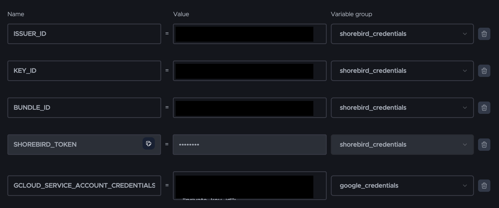

# codemagic-shorebird
CI/CD with Codemagic YAML &amp; Shorebird. 🚀

You can use the `codemagic.yaml` file with minimal changes to fit your project. Just update the necessary settings and follow the Codemagic environment variables.
As you can see in the below image.

